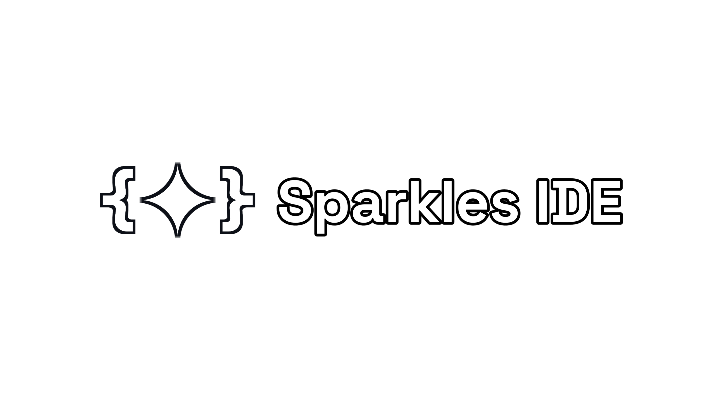

   
  
  
Sparkles IDE is an All-in-one Integrated Development Environment 
with Supporting full languages & Material Design 3

   
  
  
  

## Features &amp; Todo
- [ ] Good Code Editor Customizations
- [ ] Python Support
- [ ] Java & Kotlin Support
- [ ] Web support ( HTML JavaScript CSS)
- [ ] Terminal Activity

## How to Contribute

If you want to contribute with us just make sure that you are Respected the rule by creating an branch to work on it 

[CONTRIBUTING.md](CONTRIBUTING.md).

## Contributors 

