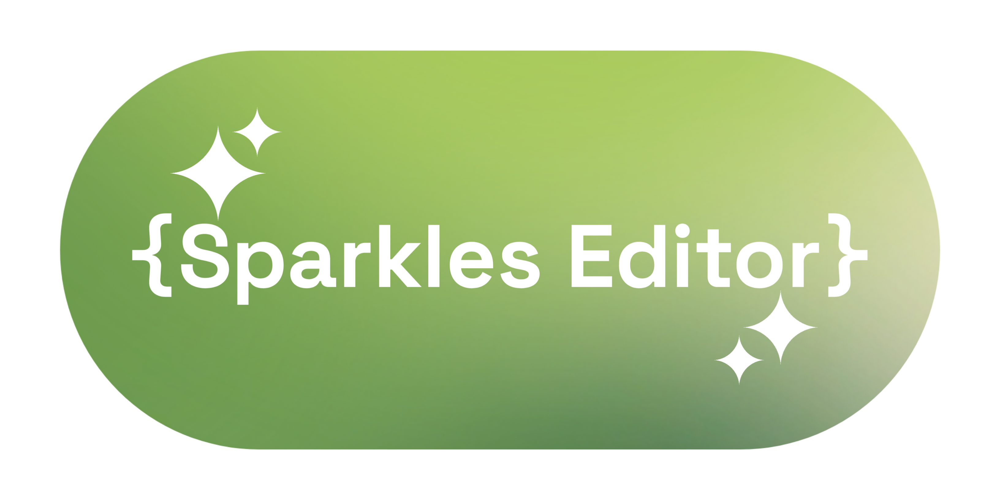

  
  
Sparkles Editor is an All-in-one Integrated Development Environment 
with Supporting full languages & Material Design 3

   

  
 
 
 

## Features &amp; Todo
- [ ] Good Code Editor Customizations
- [ ] Python Support
- [x] Java Support
- [x] Markdown Support
- [ ] Web support ( HTML JavaScript CSS)
- [x] Terminal Activity
- [x] File Tree
- [x] Great UI
- [x] Editor Sparkles Special Theme 

## How to Contribute

If you want to contribute with us just make sure that you are Respected the rule by creating an branch to work on it 

[CONTRIBUTING.md](CONTRIBUTING.md).

## Contributors 

